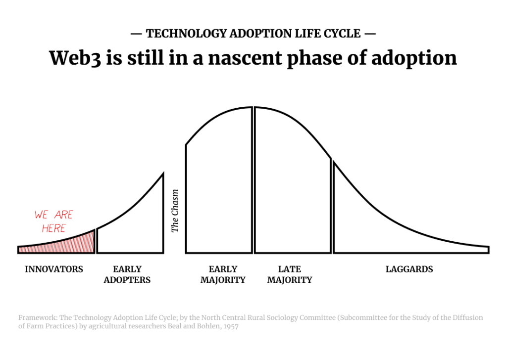
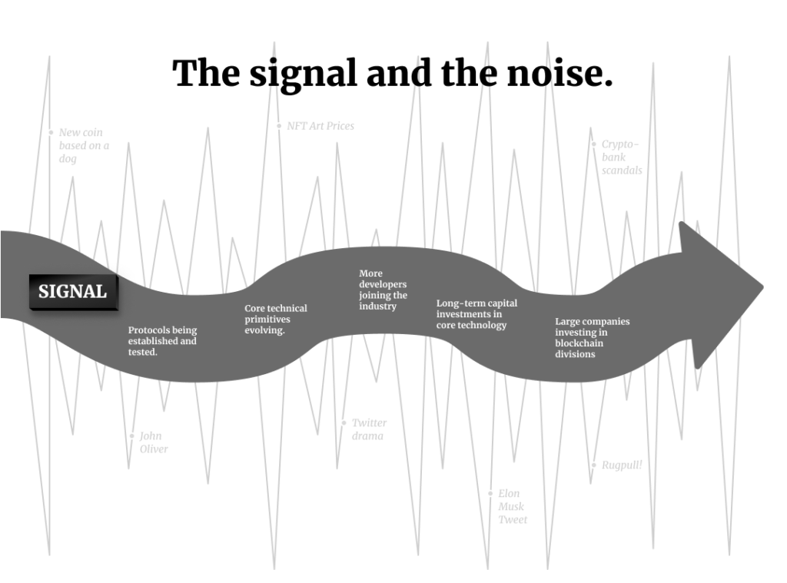
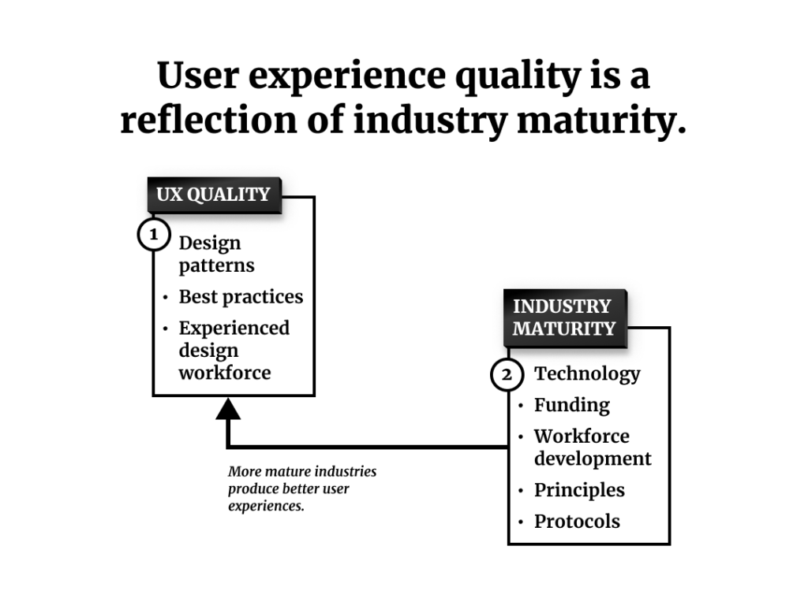
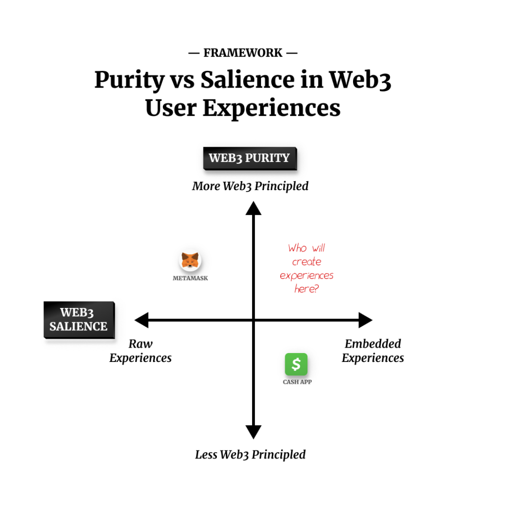
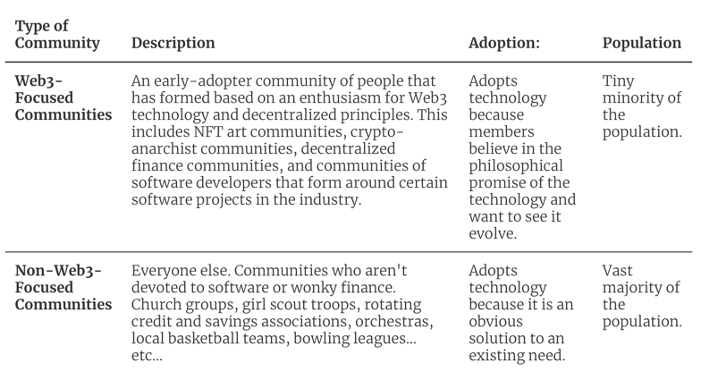
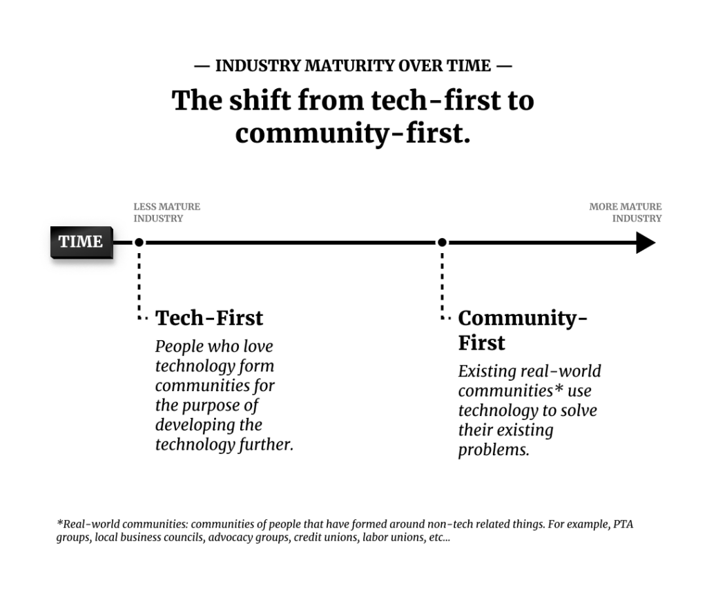
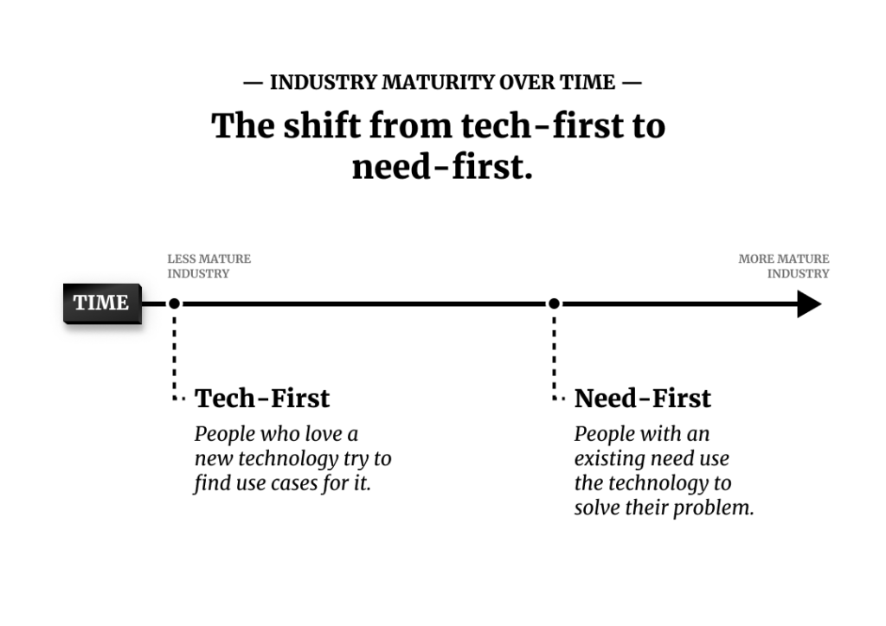

*I originally posted this article on [Mirror in February 2023](https://mirror.xyz/nefko.eth/4d8PTfVBh3d2RF9Vmak4GUSt10nZl6WbUnnpFTBVwMs).*

You should read this if…

* **You're a part of the wider tech & design industry** and have been curious about the Web3 industry from afar, but find it a little difficult to differentiate the signal from the noise. You wonder if this is something you should care about.

* **You're a part of the Web3 industry** and you're interested in an experienced UX strategist's view on what innovation in the coming year might look like. (Some of my explanations you may want to skip past, since they're explaining concepts that you may already be familiar with in simplified ways).

* **You love the idea of Web3** and are interested in perspectives from industry watchers about whether it will catch on.

* **You hate the idea of Web3** and are interested in perspectives from industry watchers about whether it will catch on.

**Where I'm coming from:** I've been a UX researcher, strategist, and designer for over a decade, I've worked for a top design agency, early stage startups, and in-house at a couple of banks. I hold a bachelor's degree in design and a master's degree in business. I spent a lot of the past year working with the [Crypto Research and Design Lab](http://cradl.org/) learning about the Web3 industry with a team of ethnography-oriented qualitative researchers.

I believe 2023 it an exciting time to be in Web3...
---------------------------------------------------

...and I'm looking forward to spending the year getting further immersed in the wider community. Web3 technology and principles are still in a nascent stage of development and adoption, so the most interesting signals to be watching for will be indicators of an industry that is maturing enough to achieve greater adoption.

### Separating the signal from the (insane amount of) noise

For the uninitiated, Web3 can feel like an incredibly noisy space. This has been especially true the last couple of years as crypto prices have experienced a dramatic rise and fall, social media companies have touted "metaverse" strategies, and celebrities have bragged about the monkey jpegs they paid silly amounts of money for.

As industry watchers, it is important to distinguish between the signal from the noise if we want to understand how a technology trend may evolve to play a role in the tech stacks that make up our work. "The noise" rarely tells the important story—despite fireworks among asset prices, Web3 projects have continued pushing releases, refining usecases, and strengthening core infrastructure.

The trend in Web3 is inviting an important shift in how every-day people use the internet. Looking past the "noise," we can understand whether the industry will be able to reach the critical mass of user adoption that will trigger the shift.

Before identifying what those signals may be, it is important to iron-out what *exactly* this "shift" is that Web3 proponents are seeking. After spending a couple of years researching the industry, here is how I think about it.

### Defining The Shift: Web3 is trying to shift every-day internet experiences away from third-party intermediaries mitigating transactions and owning of user data.

Web3 proponents differentiate the experience of today's "Web2" paradigm from their "Web3" future.

Web2 is a more centralized landscape where users submit much of their power and autonomy to large organizations—specifically governments and large corporations. Web3 proponents point to the way social media companies control and monetize user data. In recent years, they point to the ways that social media companies increasingly make data available to politicians to [influence elections](https://www.nytimes.com/2018/04/04/us/politics/cambridge-analytica-scandal-fallout.html), [censors their users for political reasons](https://www.reuters.com/article/us-amazon-com-parler/parler-sues-amazon-over-web-shutdown-alleges-political-animus-idUSKBN29G282), and amass "honeypots" of data that [attract hackers](https://www.cshub.com/attacks/articles/the-biggest-data-breaches-and-leaks-of-2022). They also point to governments who have been increasingly active in [influencing social media company censorship](https://nypost.com/2022/12/18/latest-twitter-files-show-fbi-questioned-executives-over-users-spouting-state-propaganda/) indirectly, and directly sanctioning individuals in [both their own countries](https://www.businessinsider.com/trudeau-canada-freeze-bank-accounts-freedom-convoy-truckers-2022-2) or [abroad](https://theintercept.com/2022/04/28/russia-sanctions-civilian-harm-reform/) through their control of the monetary systems.

Web3 proponents hope to offer a new paradigm where users have the ability to own and control their own money and data. It also seeks to empower people to interact in new ways with one another through censorship-resistant, pseudonymous public infrastructure rails. Most commonly, this public infrastructure takes the form of blockchains which—due to their decentralized nature—mean that they can remain resilient despite being controlled by no single entity.

The "project" is the unit of analysis for Web3. Projects may be started by individual companies, partnerships between companies, foundations, volunteerns on the internet, decentralized autonomous organizations (DAOs) or other forms. They have goals, launch software, and try to attract user adoption.

As a qualitative researcher focused on how people use technology, I use adoption as my main metric for understanding whether "**The Shift**" is happening. Up to this point, Web3 projects may be numerous, but their adoption tends to center around Web3 proponents who are inspired by the ethos and principles of Web3—not everyday users with practical problems to solve. If these everyday users start to shift, then we'll know something interesting is happening that could come to affect us all.

### We should consider Web3 in 2023 at two levels: [1] User experiences and [2] the industry that creates them.

As a UX strategist there are two levels I'll be thinking about this year.

**The first (and more obvious) level is the broad user experience** for people who use Web3 products. Up to this point, there has not been wide adoption of Web3 technologies among [Early Majority](https://docs.google.com/presentation/d/1s2OPSH5sMJzxRYaJSSRTe8W2iIoZx0PseIV-WeZWD1s/edit?usp=sharing) users. Will that change this year? Will a killer app emerge? What will the experiences be like for it? Will the dynamics of everyday users start to tip toward more Web3-oriented experiences?

> 
> **Level 1: UX Quality**
> 
> 
> 
> 
> How will Web3 experiences evolve for users?
> 
> 
> 

These are hard questions. To begin to think about them, we need to consider a level deeper.

**The second, deeper level is an industry analysis.** Designed experiences are created by industries. Experiences are triggered in the minds of users based on user-facing apps. What those apps can do is determined by the technology they rest on; which is, in turn, a reflection of the industry. Industries are made up of capital, core technologies, and workforces, which sit on top of a society's economics, politics, and cultural trends.

I've argued with my Crypto Research and Design Lab collaborators in [other](http://bit.ly/lookingahead2023)[reports](http://bit.ly/newecosystemsinweb3), the Web3 industry is still in its nascent stage. To set our expectations about how Web3 experiences will evolve, we need to ask a deeper question: how will the industry evolve?

> 
> **Level 2: Industry Maturity**
> 
> 
> 
> 
> Experiences are created by industries, so how will the industry evolve?
> 
> 
> 

While industry analysis isn't always intuitive, it does have principles. New technologies—from machine learning today; mobile and cloud technologies of a decade ago; to airplanes in the mid 20th century or railroads in the 19th —always evolve in combination with changes in economic, political, and workforce spheres.

2023 is a perfect year to watch how will Web3's norms and institutions evolve. In what ways will it shape itself like other tech trends? In what ways will it be different?

### Industry evolution is a long-term project, but we can watch for indicators.

At its core, Web3 is a philosophy and a set of technology tools that support it. "Web3 natives," the people who are immersed in the principles and philosophy of Web3, want to see a world that respects the sovereignty of individuals and enables communities to work together without reliance on centralized intermediaries.

> 
> "Web3 natives" want to evolve toward a world that respects the sovreignty of individuals and enables communities to work together without reliance on centralized intermediaries.
> 
> 
> 

**This is an ambitious, long-term goal.** It's a goal that will require overcoming a lot of norms that determine the ways industries typically organize. That said, Web3 has attracted a lot of smart people who aren't afraid to take risks, try new things, and learn from their mistakes (and the mistakes of others).

While it is a long-term goal, we can watch for certain indicators to see if the industry is progressing. There are two larger trends that I'll be curiously watching this year.

### Two Trends

The rest of this essay breaks down two large thematic trends that I'll be curiously watching this year. The first relates to the Web3 industry's maturity and ability to create quality user experiences. The second has to do with potential shifts in design practice when it relates to Web3.

These are not predictions, strictly speaking. Instead, they are things to watch—if these things manifest, it is likely that the user experience for Web3 broadly will improve and greater adoption will be reached.

#### A killer app that runs on Web3 will emerge. This will happen if the industry matures to a level that it is able to offer Web3 experiences that feel less techie for users.

* **Adoption Signal:**
	+ **A killer app may emerge**, giving a wider cohort of users access to their first "pure" Web3 experiences.

* **User Experience Level:**
	+ **Web3 Salience in user experience will decrease**, leading to smoother experiences for everyday users. This, in turn, will lead to more adoption.

* **Industry Level:**
	+ **Protocol Consolidation:** A few key protocols will rise to the top and more builders will rally around them. This will lead to greater maturity of infrastructure as a critical mass is formed.

***Simply put:*** the industry will get more mature so the user experiences will feel less techie.

#### Designers in Web3 will start to adopt a more "community centered" rather than "human-centered" approach. This will lead a shift from tech-first to community-first Web3 adoption.

* **Adoption Signal:**
	+ **Non-tech communities start using Web3 technologies:** We will start to see a shift toward existing communities adopting Web3 technology.

* **Industry Level:**
	+ **Community Centered Design practices** will become more prominant than more traditional "Human-centered" design practices.

***Simply put:*** designers will think less about individuals and think more about how they interact in communities.

A killer app that runs on Web3 will emerge. This will happen if the industry matures to a level that it is able to offer Web3 experiences that feel less techie for users.
==========================================================================================================================================================================

New technology interaction paradigms don't start to reach majority customers until a use case emerges that meaningfully improves an aspect of their day to day lives. So far, Web3 paradigms have provided no such benefits.

Trend 1 poses a question: will a "killer app"—an application that solves a real, important problem for users in a compelling way—emerge? For it to happen, it will require user experiences to improve. For experiences to improve, the indudustry will have to evolve.

### [Adoption Signal] **A killer app may emerge,** giving a wider cohort of users access to their first "pure" Web3 experinces.

Web3's offerings are still meager. Despite being a tech-industry worker myself, I've come up with a total of zero reasons to actually use Web3 technology for anything (other than asset speculation), and I've not recommended an application built with Web3 technology to any friends or family. Not once.

**A critical user experience difference between Web3 experiences and Web2 experiences is in user credentialing:** does the user "sign in" with a wallet, or do they create an account? If we begin to see *any use cases* where a critical mass of users are starting to use a wallet to interact with an app, it will be worth watching.

> 
> **What to watch:**
> 
> 
> 
> 
> If we begin to see any use cases where a critical mass of users are starting to use a wallet to interact with an app, it will be worth watching.
> 
> 
> 

Why is this such a critical indicator? The use of a wallet is a change in the relationship between an organization and a user.

**In a traditional Web2 relationship,** users expect a company to manage the front-end touchpoint (a phone app, a website, a call center, a brick-and-mortar store...) and to manage their data on the company's servers.

**In a Web3 relationship**, users will expect the organization to manage the front-end touchpoint, but they manage their own data with their wallet.

IMAGE—————————

Web3 proponents have a lot of methods for how user data can be stored, but wallets are the applications that enable people can use to keep their data their own. If we start to see a shift toward people using the wallet paradigm for app authentication, then we should take notice.

#### Today, even people in Web3 don't "eat their own dogfood."

Because Web3 is a core technology, we could see a "killer app" emerge from any sector—social media, gaming, money, identity, etc... Companies today in the space are trying to build Web3 solutions for all of these use cases and hundreds more, but none of them have seen any mainstream traction\*

*\*The two obvious exceptions are cryptocurrency speculation and, in some instance, international remittances.*

"Dog fooding" is a tech industry term that means "using your own app so you can taste the dog food you're trying to sell." It is noteworthy that even web3 natives aren't eating their own dog food yet—every community I've interacted with so far is using Twitter, Signal, and Discord (a Microsoft product).

> 
> **What to watch:**
> 
> 
> 
> 
> Will Web3 natives start to "dogfood" their own principles for social media, or will they keep relying on centralized companies like Twitter, Signal, Telegram, and Discord (owned by Microsoft) to communicate?
> 
> 
> 

A first, *very early* signal that a wider offering of Web3 experiences is starting to take hold will be when more Web3 builders start using more Web3 products in their own day to day interactions.

Before we can see any uptick in Web3 adoption, however, user experiences will need to improve. This brings me to my next point: Web3 experiences today still feel overly techie.

### [UX Level] Web3 Salience: Winning projects will create pure, embedded user experiences.

Web3 products still feel really techie. From a UX perspective, we can watch the evolution of ***Web3 Salience***—a measure of how techie something feels—among Web3 product experiences.

Something is **salient** if it is "conspicuous; prominent, or noticeable" ([Wordnik](https://www.wordnik.com/words/salient)). **Tech Salience** is a qualitative measure of how prominent or hidden the technical aspects of a product are to a user.

For example, the technology that powered early automobiles was extremely prominent. Early adopters needed to be well aware of how to crank up their internal combustion engines and how to keep track of innumerable fluids, pressures, and other metrics that kept their machines functioning. The clicks and clacks (and breakdowns) of these early machines made their underlying technologies extremely salient. Today's drivers, by contrast, needn't know anything about how their cars actually work.

**Web3 Salience** is a measure of how obvious to a user the app their using is a "Web3" app. Up to present year, most Web3 experiences were very obviously Web3: apects of user experience like seed phrases and key management require a level of technical sophistication that most users will never care about.

> 
> From a UX perspective, we can watch the evolution of Web3 Salience among Web3 product experiences.
> 
> 
> 

I call these high-salience experiences "Raw Web3 Experiences." Raw Experiences require a user to understand the fundamentals of how Web3 technology works, and are littered with "[landmines](https://medium.com/cradl/ux-in-cryptocurrency-get-rid-of-these-6-landmines-to-achieve-wider-adoption-4010ec1f6ca5)" that could completely undermine their goals and experiences.

> 
> **Raw Web3 Experiences** are user experiences with high Web3 Salience. It is very obvious to users that they're using a Web3 product and they likely need a high degree of knowledge about Web3 principles to accomplish their intended task without numerous errors.
> 
> 
> 

Until now, most Web3 experiences have been extremely raw. The major exception to this has been simple custodial wallet experiences ususally ***embedded*** in banking experience apps that enable people to buy crypto. For example, CashApp enables a person to buy Bitcoin almost like a stock. In these cases, the Web3 Salence factor is low: users don't have to know anything about blockchains, crypto wallets, protocols, smart contracts, etc...

> 
> **Embedded Web3 Experiences** are user experiences with low Web3 Salience—apps don't make it apparent to users that they're using Web3 technology, and users do not need a high degree of understanding of Web3 principles to be successful in their intended tasks.
> 
> 
> 

The above statement about custodial wallets, however, is likely to make principled Web3 natives uncomfortable. A core tenet of Web3 is that a user holds their own assets themselves, not with an intermediary. In the case of CashApp, the Bitcoin is held by a corporation: Block, Inc. Custodial wallets may hold crypto assets, but because they're technically held by an intermediary, they're *fundamentally not Web3*.

An industry can't grow if it requires high levels of technical understanding from its users. In 2023, the projects that will lead ***The Shift*** will be those that can figure out how to launch pure, embedded experiences.

> 
> **What to watch:** In 2023, will Web3 projects start to offer more embedded pure-Web3 experiences? If so, it may lead to greater adoption.
> 
> 
> 

There is a *lot* of talk in the Web3 industry right now in ways that projects will start to be able to offer less Web3 Salient experiences. I'll undoubtedly be commenting on more of them on this blog in more detail moving forward.

Pure embedded experiences, though, are *hard* to create today for a simple (but daunting) reason: the core infrastructural technologies just aren't there yet. For these experiences to become possible, the industry as a whole will need to evolve. In particular, the industry needs a concentration of devleopment effort on those core technologies. That brings us to the next point: a consolidation around protocols.

### [1.2] The industry will start to consolidate around a few protocols.

A distinctive part of Web3 is its decentralized ethos. For new comers, this can be a little confusing, but the best way to think about this is to focus on two concepts: **interoperability** and **shared resources**. Both of these enable an industry to maximize efficiency in its growth without consolidation toward large oligarctic organizations. One of the biggest shared resources that enables interoperability is protocols.

**A protocol** is a set of standards that everyone's code follows. If there is a protocol, two completely separate organizations will be able to build software that will be interoperable—even if those organizations don't communicate with one another. Consider how the industrial revolution was able to accelerate once everyone decided to use standard mm- or inch-based measurements on their nuts and bolts. Those standards are protocols.

An example from Web1 is the HTTP protocol. Because everyone in the industry agrees on this protocol, it is possible to have hundreds of companies building browsers and thousands of companies building websites without everyone needing to coordinate individually.

The centralization of standards such as web protocols is what makes decentralized ecosystems possible: they reduce the "[transactions costs](https://en.wikipedia.org/wiki/Transaction_cost)" of multiple organizations working together.

Protocols act as flywheels for industries in a lot of ways. For example, they lower redundancy and cost through:

* **Interoperability:** Protocols reduce the headaches of trying to make bespoke systems work together (imagine how easy it is to go to the hardware store and know that any 9mm nut can be turned by any 9mm wrench).

* **Workforce development:** Consider how many low-cost fullstack web development bootcamps exist today. The reason this industry can thrive is because there are a handful of skills fundamental languages that *everyone* can learn to get their first programmer job (HTML, CSS, JavaScript...).

* **Division of Labor:** Protocols create opportunities for companies to emerge that optimize for very narrow problems in a tech stack with the confidence that there is a large market to sell to. One (of hundreds) of examples from Web2 is [Postman](https://www.postman.com/), an application that developers use to test API calls while building. Postman works for everyone in web development because everyone uses the same web protocols.

However, protocols take a lot of effort. Every protocol needs a community of foundations, companies, and individual contributors to rally around it, fund its improvement, and build out intermediate software. This, in turn, enables customer-facing companies to more easily build out apps. Protocols also take a lot of marketing: HTTP may be great, but if the wider engineering community had heard of it, it could have never become ubiquitous.

### Protocols in Web3: A thousand flowers blooming.

Today it seems like everyone in Web3 is trying to establish a protocol. This is important in a nascent industry because nobody really knows what the best protocol design is for use cases that don't exist yet.

Letting a thousand flowers bloom, however, is an expensive way to operate. The more time and money are spread between competing on protocols, the less concentrated focus there can be on protocol improvement and the development of practical apps. As the Crypto Research and Design lab noted in its Looking Ahead to 2023 report, many app-oriented teams find themselves spending more time building out basic infrastructure components than focusing on user experience aspects because the fundamental infrastructure of all of the web3 protocol ecosystems are so underdeveloped.

> 
> **What to watch:**
> 
> 
> 
> 
> Will the industry consolidate around fewer protocols? If so, it may mean an acceleration in user experience.
> 
> 
> 

As the industry warms up to the current bear market and resources become more scarce, I'll be interested to see if there is some consolidation of protocols. If there is, we will likely see an acceleration of improvement on user experiences as more engineers will be focused on maturing the middle-ware problems that are needed to build better customer-facing apps.

Much of this section is inspired by a report we wrote at the Crypto Research and Design Lab (kudos to Lauren Serota in particular who was a wonderful thought partner and the primary writer on that section of the report).

Designers in Web3 will start to adopt a more "community centered" rather than "human-centered" approach. This will lead a shift from tech-first to community-first Web3 adoption.
=================================================================================================================================================================================

"Communities" can describe organizations large and small. They can be a girl scout troup. A bowling league. A religious organization. An orchestra. A community garden. They consist of members who organize around a purpose—devoting their time, effort, money, or other resources to the community to achieve that purpose.

Communities have a special set of problems. They bind themselves with rules, and use democratic processes to alter those rules. They often elect members to play certain roles, and give those roles permissions to control and manage communal resources. They also mitigate how their members interact, often trying to find ways to streamline those interactions. They track certain accomplishments or contributions that each member has made, and find ways to track and display these attributes to other members of the community.

One of the core value propositions of Web3 technology in theory is the ability to enable groups of people to manage community assets in streamlined, more transparent ways. So far, the adoption of Web3 technologies by existing communities have been anemic. In 2023, it will be interesting to see if this starts to change.

### [ Adoption Signal ] Community-first rather than technology-first

I want to distinguish between two types of communities who interact with Web3 in different ways. ***All*** communities are focused around something (bowling, religion, orchestral music, etc...). ***Some*** communities are focused around Web3 technology. I'm going to give these two categories names for now:

In any evolution of a new technology, the early phases are made up of Technology-Focused Communities. In the garage-days of Apple Computer, for example, PCs were sold to tech enthusiasts at conferences, meetups, and through industry magazines. These communities were made up of professionals and skilled amatuers who were happy to put up with UX shortcomings (and probably saw these short-comings as opportunities to demonstrate their sophistication or start their own businesses).

Over time, the critical mass of communities who use a technology shifts from Tech-Focused to Non-Tech-Focused. Today, most churches, parent-teacher associations, and hockey clubs use PCs to communicate with their members, organize their events and manage the accounting for their dues.

The reason for the shift comes down to the difference in motivations between Tech-Focused Communities and Non-Tech-Focused Communities. The members of Tech-Focused Communities are enthusiastic about a technology's promise: they believe that as the technology improves, the world will change in a way that supports their utopian visions. They want to be a part of that change, and want to surround themselves with others who will be a part of that change.

> 
> ***Members of Tech-Focused Communities**\*\* are enthusiastic about a technology's promise.*
> 
> 
> 
> 
> ***Members of Non-Tech-Focused Communities**\*\* adopt technology because they have a need today that is precluding them from community activities.*
> 
> 
> 

Non-Tech-Focused communities don't care. They adopt technology because they have a *need today* that is precluding from the softball games or band camp planning that they are focused on. These communities have a low proclivity to adopt new technology based on a promise: they need something that solves a problem right now in a useful and useable way.

Web3 is still a nascent technology, and as such, almost all communities that use it are Web3-Focused Communities. We'll know a change is happening when adoption starts to occur within Non-Tech-Focused Communities.

We've started to see this a little bit already. A live example is happening in a community in The Berkshires, where a project called [Humanity Cash](https://humanity.cash/) has helped the community digitize its local currency. [The Berkshares App](https://spectrumnews1.com/ma/worcester/news/2022/03/25/digital-berkshares-app-launch) has extremely low Web3 salience, but silently runs on blockchain technology embedded in the background.

> 
> **What to watch:** Do we see Non-Tech-Focused Communities adopting Web3-oriented solutions?
> 
> 
> 

App experiences will pave the way. Communities won't really be able to have these types of trustless interactions unless a plurality of participants in the community is able to understand how the system works well enough to interact with it. This can only happen if user experiences improve.

This will necessitate better user ***interface design*** overall, of course, but Web3 also invites a shift in the process of designing interactions. "Human centered design" is still the common trend in the design industry today, but the principles of Web3 will push toward a new type of practice. This practice will focus primarily on the interactions *between members of a collective organization*: community-centered design.

### [ Industry Level ] Community-centered Design Practices will be more important than "Human-Centered" design practices

In the professional design work, the meme of "Human-Centered Design," often shortened to "HCD" rose to prominence in the last several decades, HCD became an important rallying cry in an era centered around neoliberal business models that focus on customer agency. With this important development, the design industry evolved: vocabularies and practices were established, thought leaders were made, books written, talks given, university programs emerged.

The fundamental unit of analysis in Web3 shifts from the individual human to the community. Social interaction—more than simple individual psychology—becomes key.

Social *constructs*—like identity and money—only become real in social *contexts*. Web3's core use cases center around questions that communities manage today:

**Web3 projects must ask how does the communities:**

* manage units of exchange.

* account for ownership.

* identify who are and are not members of the community.

* manage what roles members of the community have.

* manage access to community-owned resources.

* track actions that members of the community have taken.

As a philosophy and technology, what makes Web3 special is its ability to empower communities of people to interact without reliance on centralized intermediaries.

Community Centered Design is already an established practicioner faction within the broader design industry. As Web3 matures, we can expect more of these practices and practitioners to influence the Web3 industry's design processes.

> 
> **What to watch:**
> 
> 
> 
> 
> The vocabulary of Community Centered Design will grow in prominence within the Web3 industry.
> 
> 
> 

This won't be limited to Community-Centered Designers. The Web3 industry today does not talk about social dynamics in a mature way. Much of the assumptions and normative aspirations I've heard about how "agents" in future web3 systems will act feels distinctively like we're imagining communities of homo economicus rather than communities of human beings. As more people with a backgrounds in traditional social science (like sociology or anthropology) or applied social-science (like community-centered design practitioners) enter the space, I expect to see more maturity in the way the industry crafts experiences.

> 
> **What to watch:**
> 
> 
> 
> 
> More people with traditional social science (like sociology or anthropology) or applied social-science (like community-centered design practitioners) enter the space.
> 
> 
> 

Conclusion: the road ahead
--------------------------

This essay is very personal: I'm excited to see how this industry grows and evolves—both as a UX strategist and as an industry analyst.

I also have a personal stake: I don't believe the paradigms of digital interaction championed by Web2 is sustainable. As mentioned above, the cracks are already starting to show: the past several years have seen increased skepticism of large corporations holding and monetizing user data.

These trends are even more worrying because our day-to-day interaction with digital systems is evolving. As machine-learning systems become even more embedded in our day today, new forms of data will start being collected. Machine learning bots need to train on information about us to have better conversations and give us better advice. Health tracking apps need to know more about us to make better predictions. Personal assistant bots need to know more about our daily lives to help us manage them.

We need a paradigm shift in the way we interact with each other and our data if we want to unlock all of the benefits these technologies promise without jumping head-first into a dystopian nightmare. The Web3 industry is starting to give us glimpses of what that non-dystopian future might look like.

We'd do best to pay attention.

