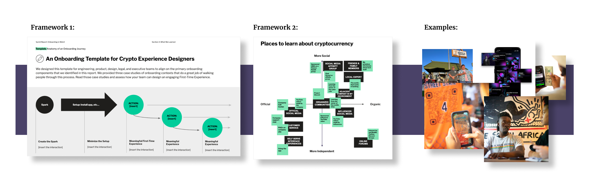
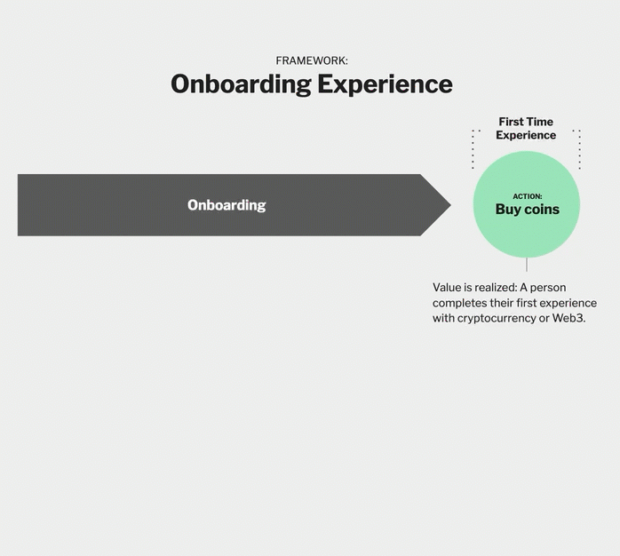
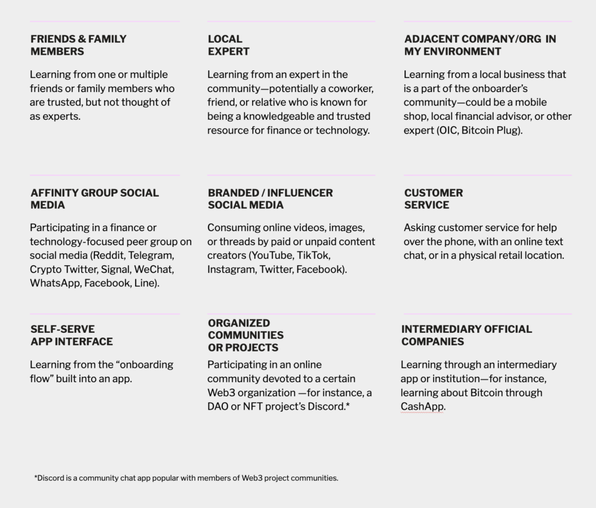
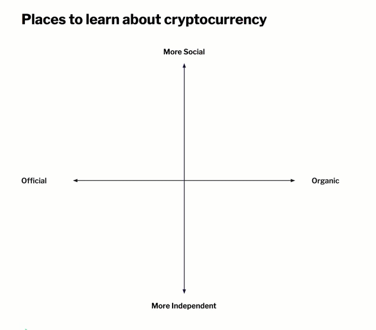
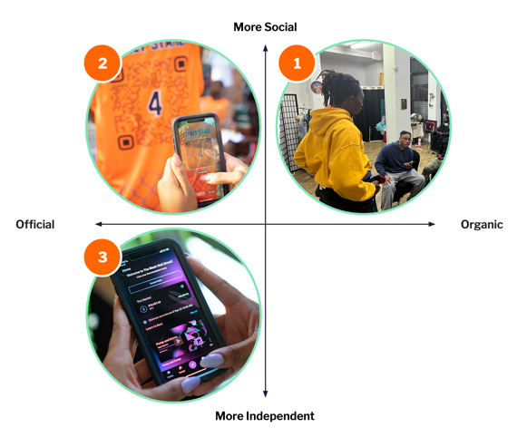
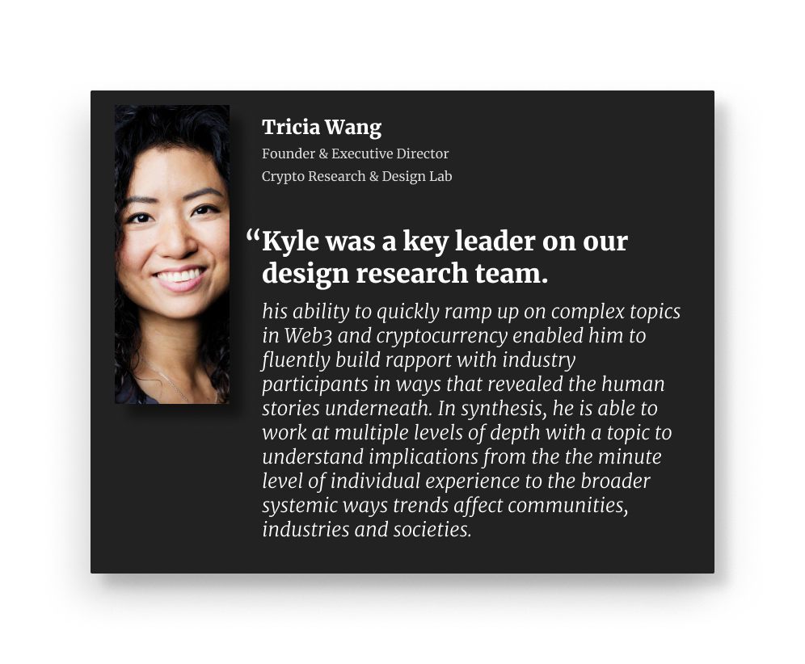

Onboarding to Cryptocurrency was a human-centric report I led with researchers from the Crypto Research and Design lab. in the report, we focused on the human side of what it was like to onboard to crypto through two key frameworks and three example vignettes from the field. 

[Read the full report →](https://docs.google.com/presentation/d/1TSmH-0PNfF7vlHTT0IK5eCWDZzw1U0ZSaqeoE7wLjDw/edit?usp=sharing) 

## **Onboarding is outside the interface.**
--------------------------------------------------
It is critical for product designers to understand that onboarding to a new technology requires a mental shift that happens outside of app interfaces. Onboarding of new financial technologies has a heavy social element. We explore several real-life examples of this in our report. 

Before we do, however, we establish the Onboarding Experience Framework as a way to compare different onboarding experiences. 

### **Framework: Onboarding Journey**
--------------------------------------------------
Lauren Serota and I created the Onboarding Experience framework as a way to analyze and design onboarding experiences. We break apart a period of time we call **The Spark**—the time between when a person becomes aware of something new and the time they complete the **Signature Experience** of the new thing for the first time. From there, we identify two key barriers, the understanding barrier and the setup barrier, as things that must be overcome to reach the first time signature experience. 

With this framework in mind, we illustrate several moments when real people overcame these barriers through well designed product experiences. 

[Read more about this framework in our report -->](https://docs.google.com/presentation/d/1TSmH-0PNfF7vlHTT0IK5eCWDZzw1U0ZSaqeoE7wLjDw/edit#slide=id.g168eb9d68bc_5_1) 

### **Framework: Ways of Onboarding**
--------------------------------------------------
Onboarding is a social experience: people try new things when they can learn about the value and process of a new technology from other people. Our research revealed a host of important social touchpoints that influence the onboarding journey.

In this framework, we found it useful to plot these touchpoints on vectors based on how official or unofficial the channels were, and how individual or social they were:

Our three in-depth vingettes focused on three examples of experiences that captured these dynamics at different points of the framework:

1. [**Nile the Community Teacher**](https://docs.google.com/presentation/d/1TSmH-0PNfF7vlHTT0IK5eCWDZzw1U0ZSaqeoE7wLjDw/edit#slide=id.g15f4deb9751_0_282)

2. [**The Bitcoin Classic Streetball Tournament**](https://docs.google.com/presentation/d/1TSmH-0PNfF7vlHTT0IK5eCWDZzw1U0ZSaqeoE7wLjDw/edit#slide=id.g15f4deb9751_0_422)

3.  [**The Black Wall Street App Experience**](https://docs.google.com/presentation/d/1TSmH-0PNfF7vlHTT0IK5eCWDZzw1U0ZSaqeoE7wLjDw/edit#slide=id.g15f4deb9751_0_427)

Read more about these frameworks and our human-centric research-based examples in [our report -->](https://docs.google.com/presentation/d/1TSmH-0PNfF7vlHTT0IK5eCWDZzw1U0ZSaqeoE7wLjDw/edit#slide=id.g20394a74309_0_53) 

### **Working with CRADL**
--------------------------------------------------

I led four reports during my time at CRADL. It was a wonderful experience—a rare one for me to focus solely on research (without combining it with practical UX design). 

During my time with the organization, I had the pleasure of presenting my research at the Consensus conference in Austin, Texas, conducting research in several states in the United States, and working with an amazing team of researchers. 

This research was conducted in what was still a very new industry. Over the years, I've followed the thread working with many other clients across the crypto industry across a range of interesting and important topics. 

Huge thanks to [Lauren Serota](https://www.linkedin.com/in/serota/), [Tricia Wang](https://www.linkedin.com/in/triciawang/), [Katherine Paseman](https://www.linkedin.com/in/katherine-paseman/), [Chris Rogers](https://www.linkedin.com/in/chris-rogers-506167232/), and [Valerie Viard](https://www.linkedin.com/in/claude-valerie-viard-239b661b4/) who I worked with directly (and a few others including [Pablo Pejlatowicz](https://www.linkedin.com/in/pablo-pejla/), [Renée Pinto da Silva Barton](https://www.linkedin.com/in/ren%C3%A9e-pinto-da-silva-barton-b3829098/), and [Cas Puls](https://www.linkedin.com/in/cpuls/)) who challenged my thinking daily.

