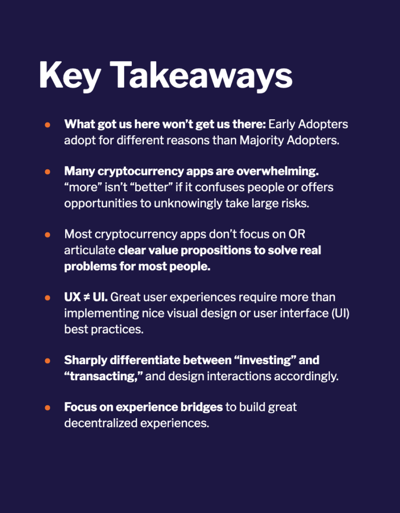
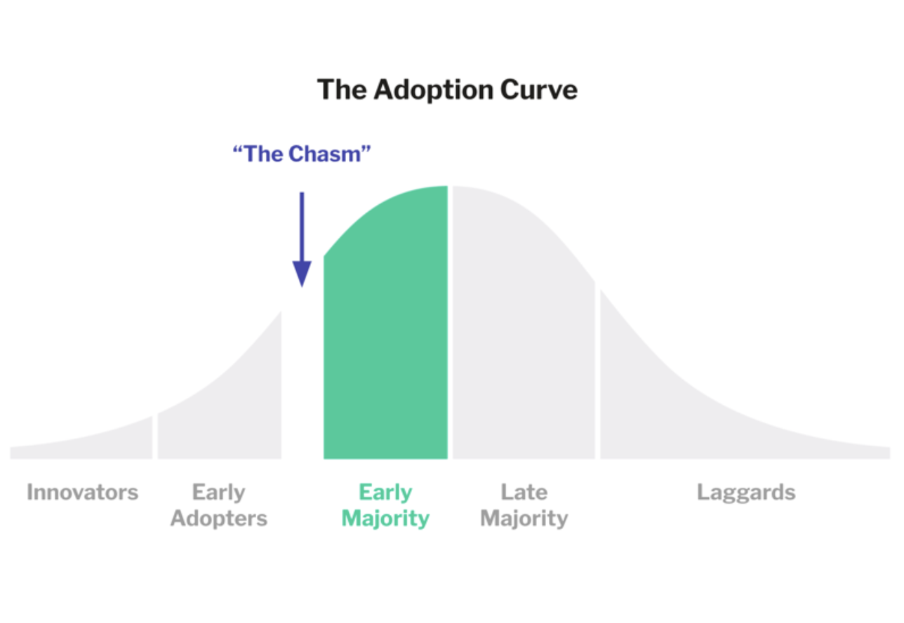
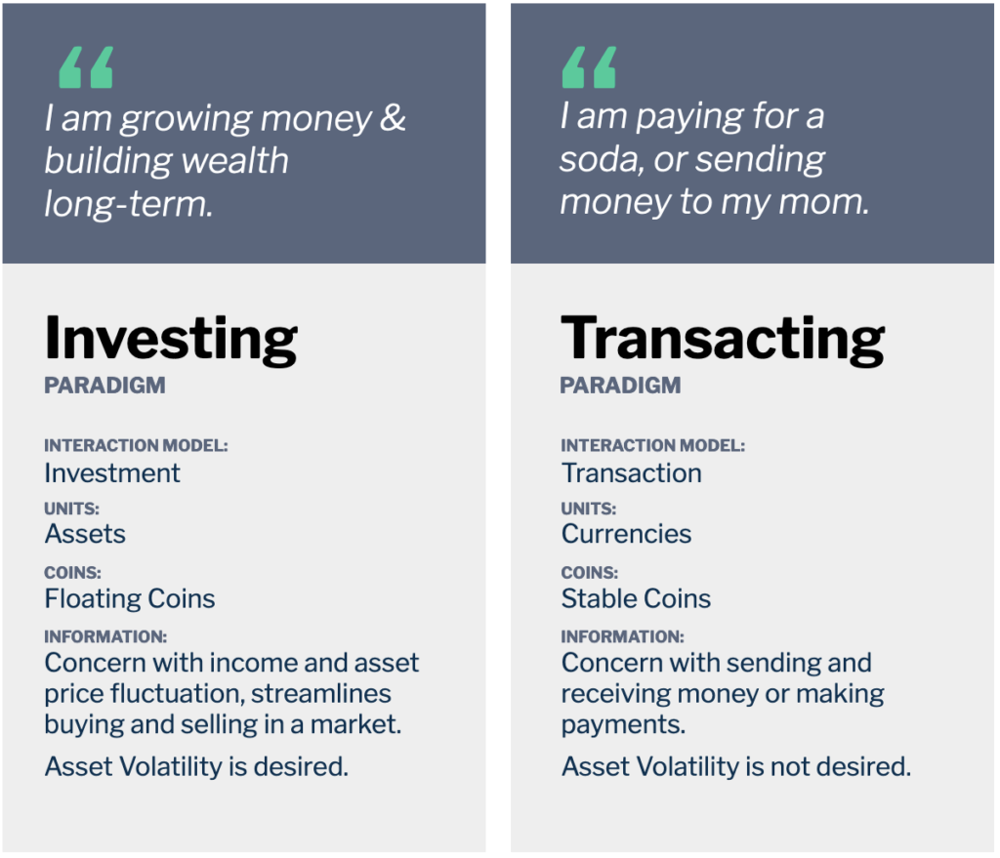
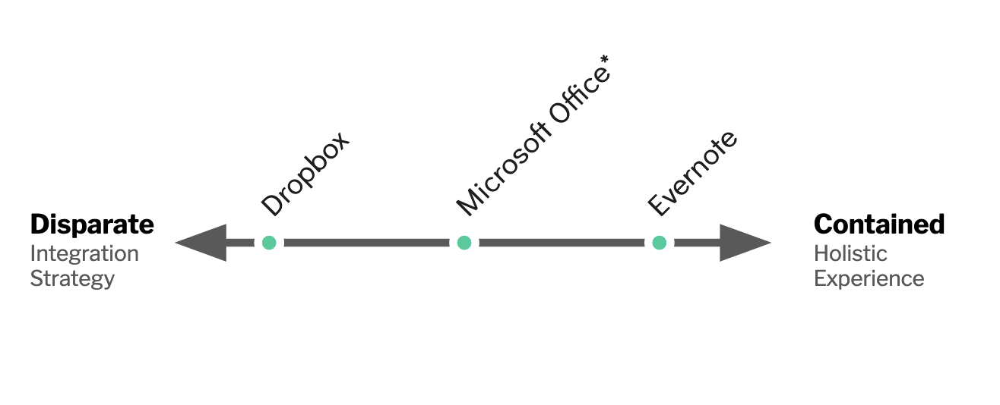
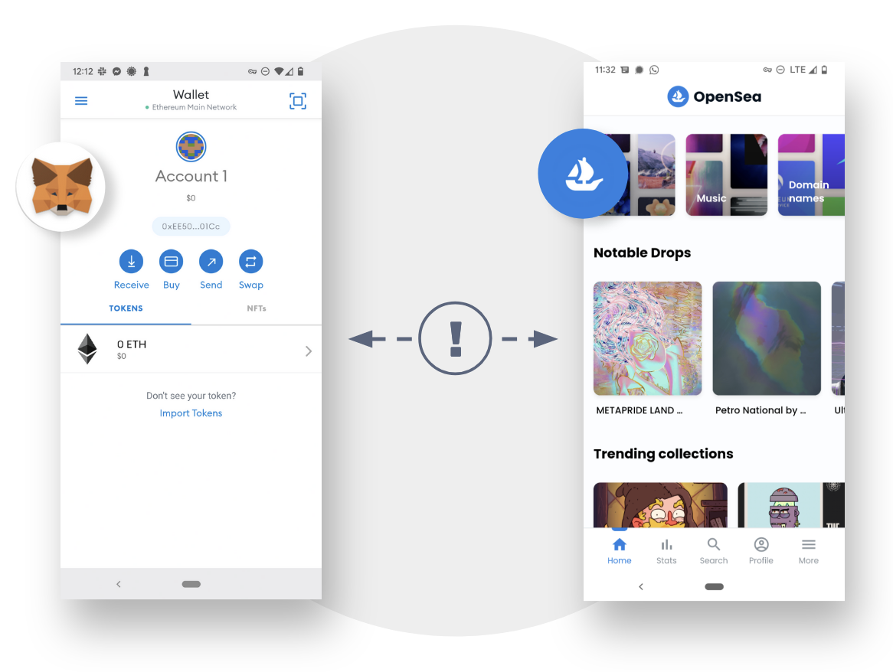

The UX in Cryptocurrency Report was published with the Crypto Research and Design Lab (Cradl) in 2022. Through an analysis of more than 30 apps, we formed high-level frameworks for understanding the current state (and future challenges) of UX in the web3 industry. 

[Read the full report here -->](https://docs.google.com/presentation/d/1NjQVNM8dvxU35Zg4Mr2rjMKTnGOAFAZy1uINdSeMZFo/edit?usp=sharing) 

## **Executive Summary**
--------------------------------------------------
CRADL believed that cryptocurrency adoption (if done well) has the potential to drive positive change in the world. Most of our research focuses on how the design of cryptocurrency products—and the cryptocurrency industry as a whole—may positively or negatively affect the financial health of everyday people. 

#### **Adoption is a prerequisite for impact.**

We’re mindful that, for any technology, adoption is a prerequisite for impact, and that clear value and a good user experience are prerequisites for adoption. 

This report differentiates between **Early Adopters** who try new things driven by an interest in tech (or, in this case, sophisticated financial use cases) and **Majority Adopters** who try new things based on ease of use, cost barriers and the ability to solve an obvious problem in their lives. 

We propose that the industry today will need to evolve to attract **Majority Adopters**; a big part of that evolution is how well people’s needs are met by new products, and those products’ usability.

### **This report focuses on the state of cryptocurrency app user experiences (UX) in 2022.**
Our core question: what attributes of today’s experiences create barriers to adoption for people who might use cryptocurrency for retail finance purposes? We identify two large barriers to adoption: 

- **Value Propositions** (outside of currency speculation) are not clearly articulated to users through apps. Many apps may anticipate becoming gateways for people to interact in a Web3 enabled ecosystem, but so far, that ecosystem does not exist, so the apps have no obvious use.

- **User Experiences** are overwhelming, unfocused and filled with “landmines”: opportunities for people using the app to make a simple mistake that leads to irreversible consequences.

Our review of app interfaces shows us that the most important user experience challenges run deeper than interface design. The next phase of cryptocurrency experience development will need to continue focusing on the fundamentals: design infrastructure and solutions that don’t require people using apps to master technical concepts, and find use cases that solve problems in the majority of people’s lives today.

## **Key Frameworks**
--------------------------------------------------
Frameworks are an important part of understanding any new field in new ways. This report created several frameworks for thinking through the challenges that the web3 industry faces ahead.

### **Investing vs Transacting Paradigms**
Drawing on years of past experience conducting qualitative research in finance around the world, we found something odd about the cryptocurrency industry: there was often a strangely fuzzy line between investment-oriented and transaction-oriented assets. 

Users have very different expectations when working with assets for transactions vs investments. These norms in other financial spaces are fuzzier (and more confusing) in cryptocurrency. 

[*Read more about the Investing vs Transacting Paradigm in the report -->*](https://docs.google.com/presentation/d/1NjQVNM8dvxU35Zg4Mr2rjMKTnGOAFAZy1uINdSeMZFo/edit#slide=id.g13dae721fbd_0_57) 

For experts in the industry, it is common to think in nuanced ways about the theoretical aspects of money and to think about how advanced strategies can function over assets across a spectrum of volatility. However, when these ways of thinking make their way into interfaces, it can make things difficult for users with more simplistic, practical, and immediate needs. 

The report has more information about these differences and examples of interfaces that handle them well and... not so well.

### **Contained vs Disparate Experiences**
Important to the ethos of web3 is the idea of growing ecosystems—not just products. This means that companies need to build themselves—and product managers need to consider their strategies—in different ways than web2.

Example of how more Disparate and more Contained experiences introduced a new technology—cloud infrastructure—to mainstream consumers. 

Our framework of Disparate vs Contained experiences gives us a language to start having this conversation. Contained experiences mean that a single company or organization can create a holistic experience that introduces a new technology to consumers. However, these strategies work better for some usecases than others. 

Since web3 is fundamentally a transactive technology—it utilizes blockchain to enable trusted relationships among untrusted parties—it implies companies may need to understand how to adopt disparate strategies through coordinated ecosystems to work out. 

[Read more about the Contained vs Disparate Framework in the Appendix of our report -->](https://docs.google.com/presentation/d/1pmOG5Cbw_b4Ag46lW5QOr_YDw8W5OZGkPLjKbXwH-e4/edit#slide=id.g14064053fca_0_18) 

### **Experience Bridges**
An ethos reliant on an ecosystem of disparate experiences requires strong bridges for users to understand how interactions should work. In 2022, the industry was focused on the vulnerabilities of cryptocurrency "bridges" that may lead to a loss of funds—a huge problem. 

On the UX side, however, we focused on the weakness of the experience going from one app to another. In most of these situations, it was extremely difficult to form bridges in the user experience between one place and another—leaving even our "crypto researchers" confused most of the time. 

We believe that strong experience bridges are the only thing that will help the industry succeed without losing sight of its ethos. 

## **Working with CRADL**
--------------------------------------------------
I led four reports during my time at CRADL. It was a wonderful experience—a rare one for me to focus solely on research (without combining it with practical UX design). 

During my time with the organization, I had the pleasure of presenting my research at the Consensus conference in Austin, Texas, conducting research in several states in the United States, and working with an amazing team of researchers. 

This research was conducted in what was still a very new industry. Over the years, I've followed the thread working with many other clients across the crypto industry across a range of interesting and important topics. 

Huge thanks to [Lauren Serota](https://www.linkedin.com/in/serota/), [Tricia Wang](https://www.linkedin.com/in/triciawang/), [Katherine Paseman](https://www.linkedin.com/in/katherine-paseman/), [Chris Rogers](https://www.linkedin.com/in/chris-rogers-506167232/), and [Valerie Viard](https://www.linkedin.com/in/claude-valerie-viard-239b661b4/) who I worked with directly (and a few others including [Pablo Pejlatowicz](https://www.linkedin.com/in/pablo-pejla/), [Renée Pinto da Silva Barton](https://www.linkedin.com/in/ren%C3%A9e-pinto-da-silva-barton-b3829098/), and [Cas Puls](https://www.linkedin.com/in/cpuls/)) who challenged my thinking daily. 