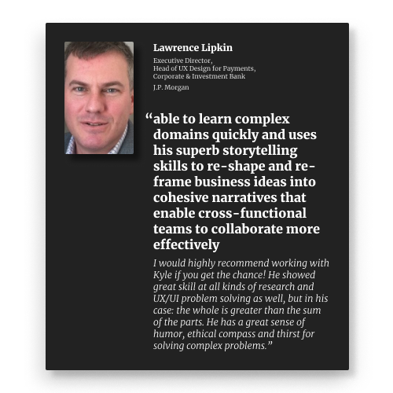
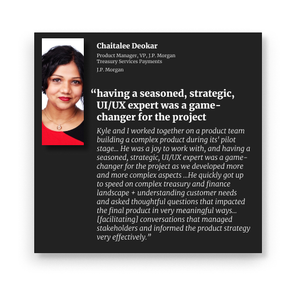

I was super excited to see J.P. Morgan and Blackrock's public announcement about their on-chain collateral management pilot.

I worked on the interface for the initial pilot of this product during my time with J.P. Morgan Onyx—the company's blockchain-focused division. This particular project solved a major (and expensive) painpoint for complex trading organizations: collateral management.

High-frequency investors managing large portfolios need to maintain collateral for their leveraged positions (usually risk-free assets like bonds). Each day as the market value of their portfolios change, they need to increase or decrease the collateral that backs those positions. This collateral management task requires hundreds of people who set values for assets, manage yields on them, and move them back and forth between different custodians.

This is fundamentally an accounting problem, and one that distributed ledger technology (like blockchains) can help out with. By managing this collateral with on-chain assets (rather than traditional assets that need to be transferred and cleared on traditional rails), calculations and transactions can happen much faster.

It is exciting to see this public announcement. During my time at J.P. Morgan, I worked on eight or nine projects, but most remained highly confidential. It is amazing to see something out in the public.

### **My time with J.P. Morgan Onyx**
--------------------------------------------------
During my time with J.P. Morgan, I worked as a Design Strategist—a hybrid role that included design research, product strategy, and product design. I specialized in the early stages of the product lifecycle, working closely with stakeholders and potential users on product to define its scope and roadmap. This meant a lot of workshops around shared artifacts like prototypes, flow charts, or product strategy & alignment activities.

The role offered me exposure to a host of financial concepts that the world's larges bank engages in, including trade finance, liquidity management, sanctions checks, collateral management, virtual accounts & virtual banking, and even a project with the consumer-facing Chase credit card marketing team! Because it was a blockchain-focused division, I also gained a lot of exposure to concepts such as wallet infrastructure, decentralized identity, and the fundamentals of blockchain technology.

While it is exciting to see the transformative potential for web3 technology to decentralize and empower individuals with their finances and technology, I believe that traditional financial institutions will continue to play a critical role in the future—but they will need to evolve. It was amazing to be a part of that evolution at J.P. Morgan.

