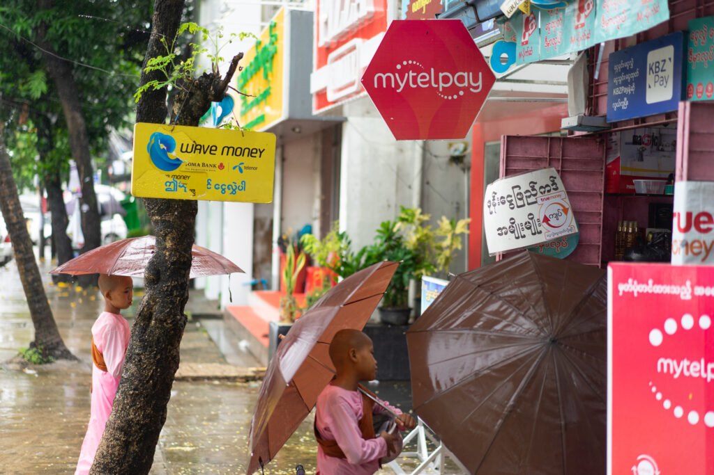
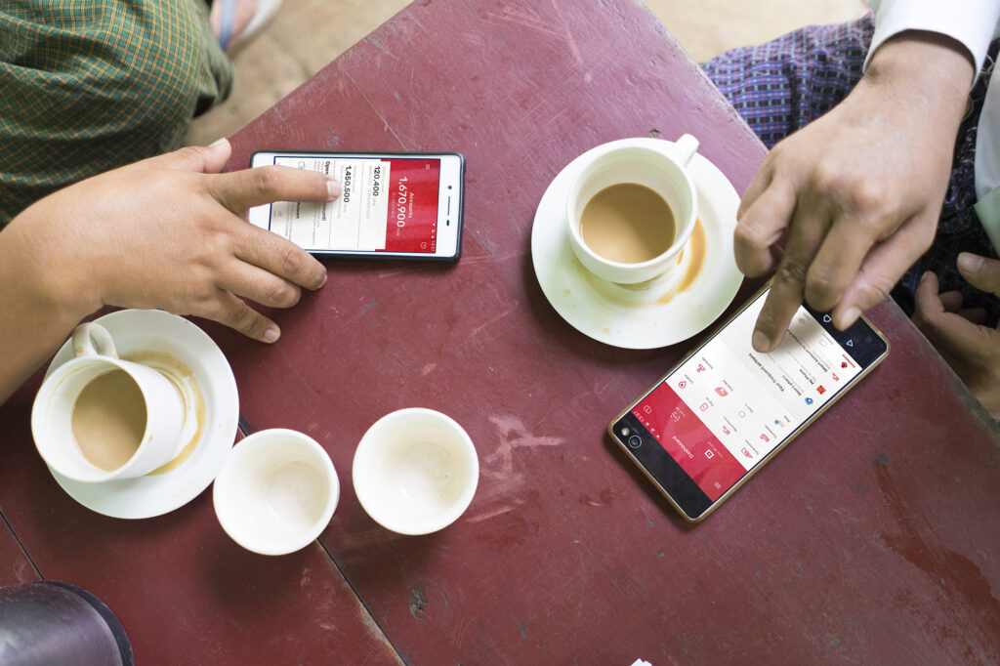
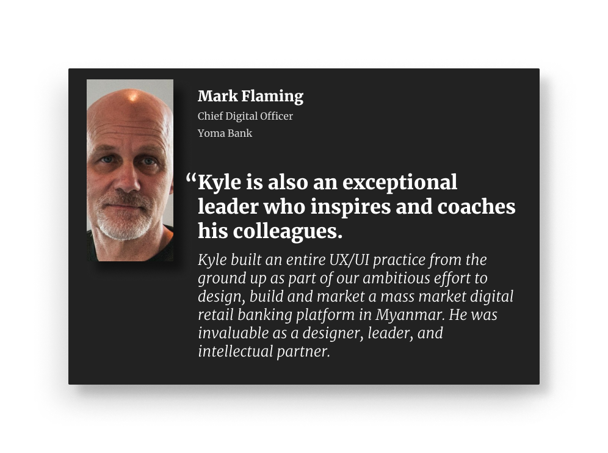
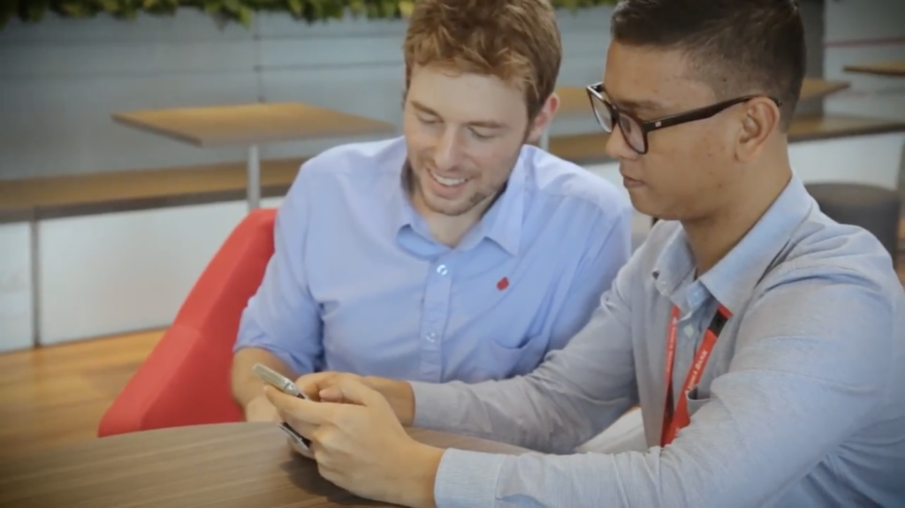
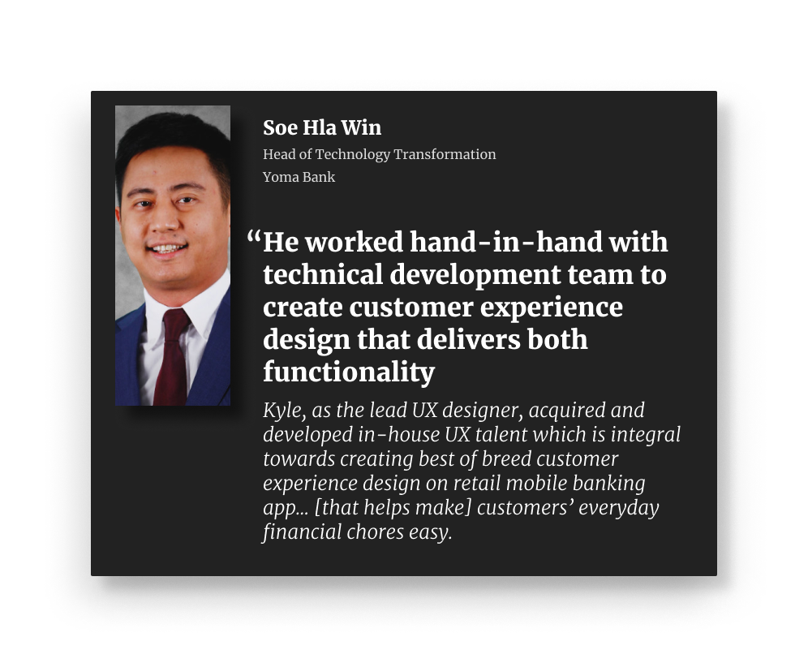
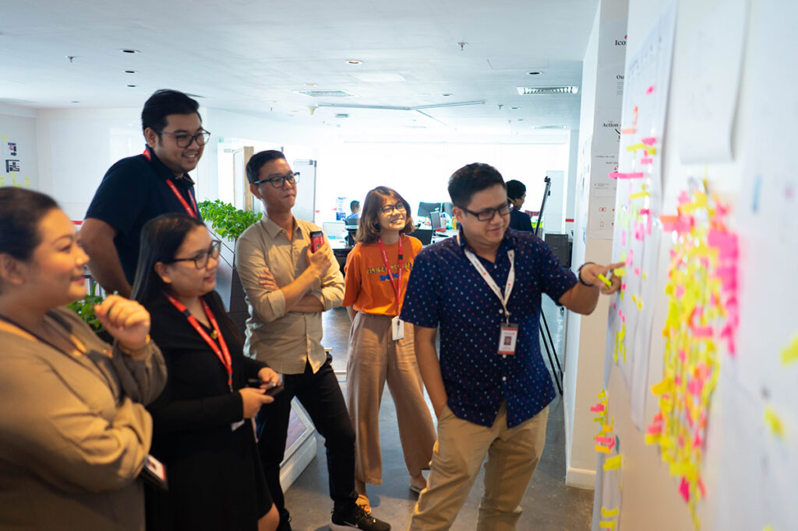
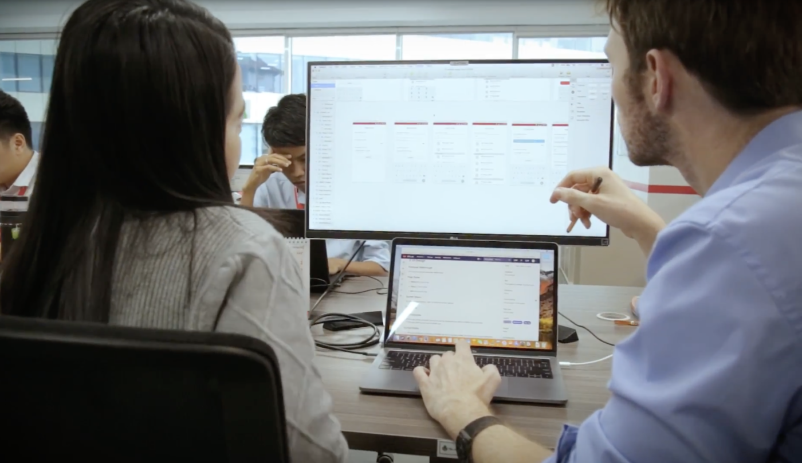
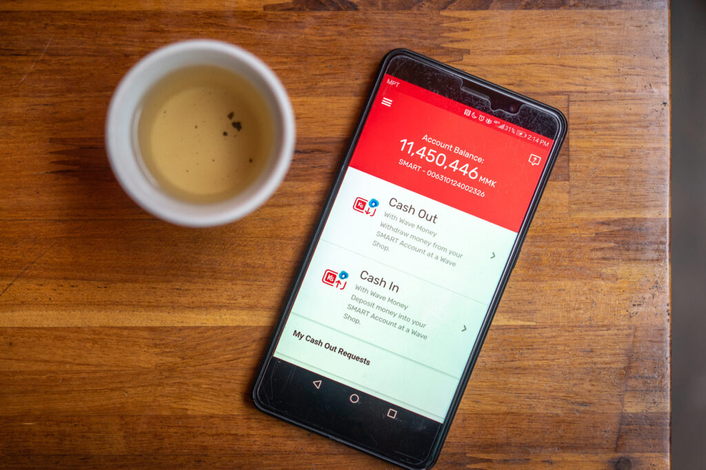
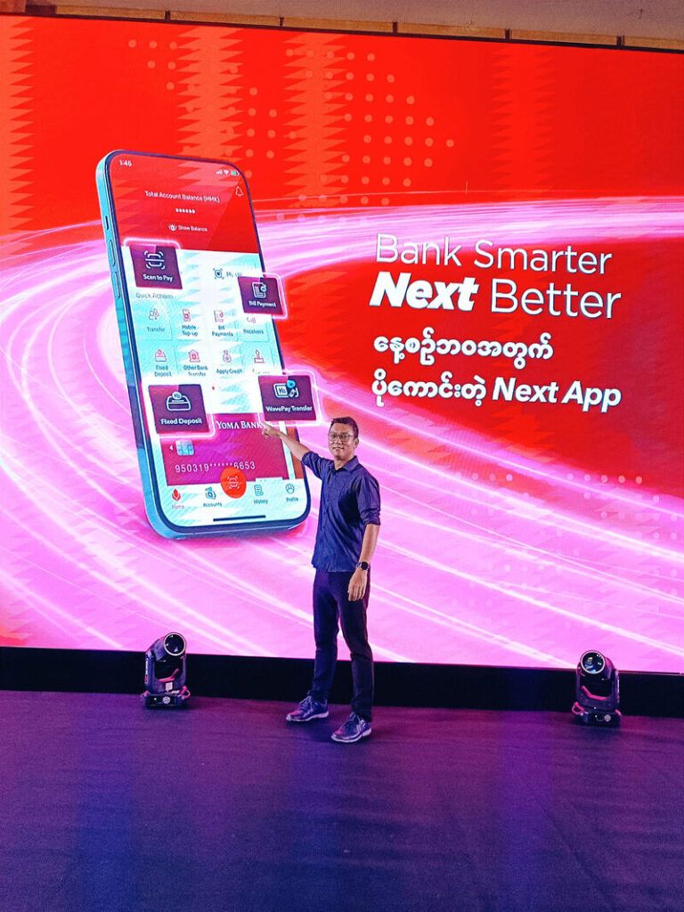
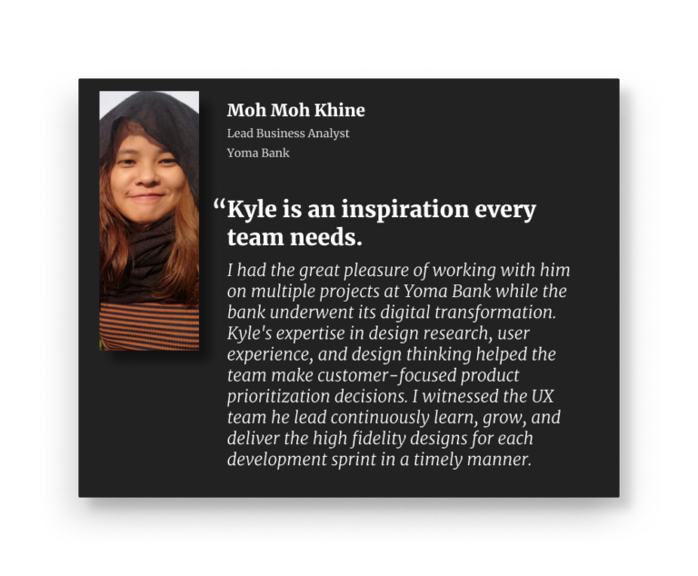

At the time I lived there, Myanmar was primarily a cash-based society with only around 30% of the population regularly using banks. Remittances and cash-in-cash-out (CICO) services were the highest-priority touchpoints.

Emerging market finance is my favorite space to work in, so when my friend and frequent colleague, Lauren Serota invited me to build and lead a UX team at Yoma Bank in Yangon, Myanmar (Burma), I was quick to say yes. 

 The population of Myanmar has traditionally been underserved by its banks—at the time of my arrival, about 70% of the population was un-banked and many who did have bank accounts didn't use them. Banking infrastructure was also dated with few digitized processes. For these reasons, Yoma Bank was undergoing a digital transformation through the establishment of a new digital division that would focus on retail banking adoption. The broader service design team—including the UX team which I would lead—was a part of this division. 

*Early designs for our flagship consumer app being used in their natural environment: the tea shop.*

 In my time at the bank, I build, trained, and led a team of local designers helping them embed design in the agile design process which maintained a handful of app experiences for different banking functions. I also led the design of the bank's flagship consumer app which would launch during my time in Myanmar as a an MVP to help the bank maintain its competitive position. Under the care of the team I left behind, the app has grown into the full-features vision that we developed back in 2018.

## **Building a team through rituals and processes**
--------------------------------------------------
Our primary focus wasn't to build apps, but to build a culture. With an energetic and fast-learning local team, we focused on building out agile processes for understanding customer needs, studying their behavior, and integrating with the banks engineers to bring products to market.

*One of my colleagues, Thuya Ko Ko Lwin showing me a prototype of an app he was working on.*

As the UX lead, my focus was on building a UX practice through mentoring designers, establishing rituals and processes, and helping the team get into a tight rhythm with engineers.

At the time, the development team was switching to an agile development cadence, so I leaned on my training as a scrum master and scrum produce owner to coach teams into finding a productive rhythm.

## **Hitting our Stride**
--------------------------------------------------
As the team expanded, and people got more comfortable about their individual practices, they could go to one another for support and advice instead of me. Distribution and coordination of work also improved. By giving the team more visibility into its workload, members could proactively coordinate to make sure everything could get done.

*Design team planning meeting, one of our weekly rituals where we coordinated on tasks prioritized for the week.*

By the end of my tenure, the team had established both a rhythm of growth and a reputation both inside and outside the bank – we had zero attrition on our team, and many of our hires came directly from competitors, contractors that we had worked with in the past, external word-of-mouth buzz, and even internal resources from other teams that quietly asked to join.

## **Launching Apps**
--------------------------------------------------
Our team assisted in the launch and maintenance of several apps during my time at Yoma. One of the largest apps was one I worked on the most directly as a designer (along with San Swe Zin Naing ): our "SMART" app which would later launch under the branded title of "Next App."

*My colleague San Swe Zin Naing and I collaborating on screens for the bank's consumer app which would launch under the name "Next App"*

This app held a strategic significance for the bank: it would form a cornerstone of our offering to retail customers new to banking services. During my time at Yoma, we established the long-term vision for the app as a platform, then reduced it to a minimum viable product that focused on one of the most important features for a cash-based society: cash in and cash out functionality that integrated with the largest remittance provider in Myanmar.

*The minimum-viable-product version of the bank's flagship consumer app. The first, single-feature version focused on Cash In and Cash Out across our network of remittance agent partners.*

The digital app experience was of particular strategic importance for Yoma Bank because the bank had chosen not to invest in an ATM network. Through its' partnership with a remittance agent network and our modern digital app, the bank was able to provide a seamless CICO experience without the the massive capital expense of buying and maintaining ATM hardware around the country. 

## **Leaving behind a stronger team**
--------------------------------------------------
As my tenure at Yoma ended, I left a strong team who had come into their own as design leaders with a tight connection with their engineering colleagues. The minimum viable product of our flagship app had launched and was being used for withdraws and deposits at money agent shops around the country.

*My colleague Thuya showing off the full-featured customer-facing app on its launch day.*

In time, (I am immensely proud to say), the team grew the flagship app to its full potential and would eventually launch under the brand name "Next App." The app represented not only a new experience for the bank's customers, but a transformation its internal processes from a traditional to a digital-first mentality.

#### **Read More**
My colleagues and I published a [publicly-facing report](http://PDF REPORT: https://drive.google.com/file/d/1t7vvpNXDhypIRn_C97tEC_FBC8KTLjQc/view) about our digital transformation efforts at Yoma which can be read here.

I've also written two case studies about my work at the bank:

* **Growing a Design Team in a Burmese Bank** is a more detailed case study of the processes and strategy I used to coach the team and build our processes.

* **Keeping a Burmese Bank Competitive with a new app** is a case study about how we quickly launched a new app as a response to a competitive threat.

A password is required to read the case studies. Shoot me a message over email (kyle [becker.designer@gmail.com](mailto:becker.designer@gmail.com)) or [Linkedin](https://www.linkedin.com/in/kyle-becker-44132223/) if you'd like to read them!

